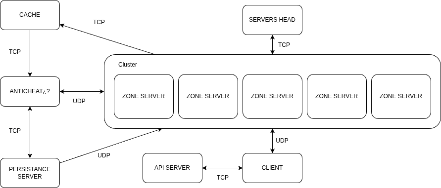

# DGS — Distributed Game Server

A high-performance distributed game server in **C++17**, aimed at MMOs with galactic-scale worlds.
Microservices over **epoll** (Linux), TCP/UDP, Kubernetes orchestration, and a real-time anti-cheat
**validator**. The design motto is *"one owner per data type"*: every entity has a single owner that
simulates it, and the rest of the world sees it as a *ghost*.

---

## Architecture



The central idea is **ownership, not broadcast**: for each entity there is exactly one authoritative
node (the one holding the *lease*), and its neighbours project it as a ghost in the meantime. The
`validador_node` is the arbiter: the owner predicts, the validator confirms.

---

## Features

- **Authority handoff with leases** — every entity has an owner *until* (`entityOwnedUntil`),
  renewable (`ENTITY_LEASE_MS`). On expiry or reassignment, authority is handed over with
  `PKT_REASSIGN` and the new owner promotes it. No "two nodes simulating the same thing".
- **Ghost → real promotion with the edge cases resolved** — the entity a neighbour saw as a ghost is
  promoted to real when it takes the lease: (a) **without duplicating it** if we already held it, and
  (b) **without letting a stale ghost clobber a real entity** during the handoff (`zone_node.cpp:673`).
- **Owner-predicts / validator-arbitrates** — the owner predicts the movement and sends a
  `ValidateRequest` correlated by `requestId` (a per-sender seq → idempotency + anti-replay). The
  validator answers `ValidateAck` with a verdict and a weight. Latency is compensated with
  `radius = v·Δt + scale`.
- **Per-project rules module with a C ABI and `dlopen`** — each game ships its
  `lib<project>_rules.so` exporting `dgs_game_module_v1()`; the core delegates `step()` at a fixed tick
  over the entities it owns. Versioned ABI: if it changes, `dgs_game_module_v2()` is added and the core
  is not edited.
- **Determinism test by double `dlopen`** — `robust_test.cpp` loads the same `.so` **twice** (two
  instances with separate state), applies the same sequence of actions and compares `serializeRegion`
  **byte for byte**. That is real determinism, not a test comparing itself against itself.
- **Drain protocol** — `PKT_DRAIN`/`ZoneLifecycle` with `requestId` + ack: when a zone is degraded or
  reassigned, its state is drained before it is cut. **Reassignment on a failed metric** (P6): a zone
  that stops reporting health triggers `LIFECYCLE_REASSIGN` and a handoff to a healthy neighbour.
- **Load-based scaling** — the orchestrator calls the Kubernetes API to scale `zone-node` (HPA) when
  the RAM/CPU threshold is exceeded.
- **Delta compression** — `EntityTransfer.dataSize` serialises only the used bytes of `data[4096]`.
- **Dynamic chunk system** — `int32_t` coordinates plus a local `float` position (millimetre
  precision); chunk dimensions arrive from the head at start-up.
- **Terraform with a module per node** — `terraform/modules/{network,k8s,mongodb,zone_node,validador,
  social}/main.tf` + `terraform/main.tf`. Plus a **CLI** (`tools/dgs_cli.cpp`):
  `run/install/up/down/status/logs`, against the cluster or locally.
- **Social node** — `social_node` owns the **non-spatial** plane (guilds, parties, friends, bans,
  guild economy): the same one-owner rule, outside of space.
- **Anti-cheat by module** — validation uses the project's rules module (`validateMove`), not a fixed
  formula in the core.

---

## Node Overview

| Node | Protocol | Port | Role |
|------|----------|------|------|
| `head_server_node` | TCP | 42424 | Orchestration, zone routing, k8s scaling |
| `zone_node` | TCP + UDP | 42420 | Entity simulation (lease), metrics, ghosts |
| `cache_node` | TCP | 42425 / 42426 | Transfer queue between zones and the validator |
| `validador_node` | UDP + TCP | 42427 / 42428 | Position validation (arbiter), forwarding to persistence |
| `persistance_node` | TCP | 42429 | MongoDB writes, asynchronous CSV log |
| `social_node` | TCP | — | Non-spatial plane: guilds, friends, bans |
| `client_node` | HTTP + TCP + UDP | — | Login API → zone discovery → game |

---

## Tech Stack

- **Language** — C++17
- **Build** — CMake 3.14+ with FetchContent
- **Networking** — raw POSIX sockets, Linux epoll
- **Database** — MongoDB via mongocxx (built and tested against 3.11.0)
- **HTTP** — [cpp-httplib](https://github.com/yhirose/cpp-httplib) (header-only)
- **Containers** — multi-stage Docker
- **Orchestration** — Kubernetes (tested with minikube) + Terraform
- **Rules module** — `dlopen`/`dlsym` (`dgs_game_module_v1`), C ABI

---

## Project Structure

```
dgs/
├── include/dgs/
│   ├── types.h            # Shared structs and enums (packets, leases, lifecycle)
│   ├── packet.h/cpp       # Serialisation (pack/unpack)
│   ├── network.h/cpp      # TCPSocket, UDPSocket
│   ├── orchestrator.h     # Zone topology + k8s scaling API + lifecycle
│   ├── game_module.h      # ABI of the per-project rules module (dlopen)
│   ├── thread_pool.h      # N-worker ThreadPool
│   └── logger.h           # Asynchronous CSV logger
├── nodes/
│   ├── head_server_node.cpp
│   ├── zone_node.cpp
│   ├── cache_node.cpp
│   ├── validador_node.cpp
│   ├── persistance_node.cpp
│   ├── social_node.cpp
│   └── client_node.cpp
├── src/
│   ├── packet.cpp
│   └── network.cpp
├── tests/
│   ├── wire_test.cpp          # Golden wire-format layout (P0)
│   ├── robust_test.cpp        # Determinism by double dlopen + atomic concurrency
│   ├── spawn_parity_test.cpp  # Deterministic generation parity
│   ├── validator_e2e.cpp      # The validator end to end (arbiter answers)
│   ├── zone_e2e.cpp           # The zone end to end (asks and obeys)
│   ├── zone_policy_e2e.cpp    # Ban, lease expiry and the circuit breaker
│   ├── net_degraded.cpp       # UDP path under loss, delay and reordering
│   ├── reconnect_e2e.cpp      # Reconnection and descriptor ownership
│   ├── ghost_e2e.cpp          # Ghosts and authority handoff
│   ├── action_e2e.cpp         # The fail-closed action path
│   ├── cache_e2e.cpp          # The transfer queue (FIFO, one request = one entity)
│   ├── social_e2e.cpp         # Chat, rate limit, selective persistence
│   ├── head_routing_e2e.cpp   # Routing with two disjoint zones
│   ├── persistence_e2e.cpp    # Surviving a database outage
│   ├── orchestrator_test.cpp  # Lifecycle queue, handoff on failure, lease eviction
│   ├── client_e2e.cpp         # Login gate, zone discovery, per-chunk cache
│   ├── ping_pong.cpp
│   ├── thread_pool_test.cpp
│   └── logger_test.cpp
├── tools/
│   ├── dgs_cli.cpp        # CLI: run/install/up/down/status/logs
│   └── demo_player.cpp    # A crowd walking around, so the viewer has something to show
├── views/
│   ├── dgs_viewer.cpp     # Cluster viewer: zones + entities moving
│   └── viewer_state.h     # What it knows, with no raylib attached (so it can be tested)
├── terraform/
│   ├── main.tf
│   └── modules/{network,k8s,mongodb,zone_node,validador,social}/
├── docker/                # Dockerfile per node
├── k8s/                   # Kubernetes manifests
│   ├── namespace.yaml
│   ├── mongodb/
│   ├── head-server/       # Deployment + Service + RBAC
│   ├── zone-node/         # Deployment + Service + HPA
│   ├── cache/
│   ├── validador/
│   ├── persistence/
│   └── deploy.sh
└── third_party/
```

---

## Building

**Dependencies:**
- CMake ≥ 3.14
- GCC/Clang with C++17
- OpenSSL (`libssl-dev`)
- mongocxx driver — built and tested against **3.11.0** (with mongo-c-driver 1.30.2). Optional:
  without it every target except `persistance_node` is built, and `persistence_e2e` is not registered.
  Not packaged by every distribution; a local build works:
  `cmake -S . -B build -DCMAKE_PREFIX_PATH=<driver prefix>`

```bash
cmake -S . -B build -DCMAKE_BUILD_TYPE=Release
cmake --build build -j$(nproc)
```

Binaries land in `build/`.

---

## Tests

```bash
cd build && ctest --output-on-failure
```

Every test is registered with CTest and its exit status rules — none of them is wrapped in `|| true`.
They start the real nodes as child processes, drive them over the real protocol and assert on what the
nodes publish to the outside, never on their internals.

Two of them are worth calling out:

`robust_test` loads the rules module **twice** and demands that two instances with the same state emit
the same verdicts **and the same bytes** from `serializeRegion`. If the module used `rand()`, a wall
clock or global state, the test blows up.

`net_degraded` puts a user-space degrading proxy (loss, delay, reordering) in front of the validator
and measures **false positives on an honest player**. Every case carries a positive control: a
deliberate teleport is pushed through the same path and must come out flagged — otherwise a "0 false
positives" reading would be indistinguishable from "nothing is reaching the validator", which is
exactly the mistake that was made the first time this was measured.

---

## Running Locally

Each node reads its configuration from environment variables. The defaults point at the Kubernetes DNS
names.

```bash
# HeadServer
./build/head_server_node

# ZoneNode (chunk range, in chunk units)
CHUNK_X_MIN=0 CHUNK_X_MAX=100 \
CHUNK_Y_MIN=0 CHUNK_Y_MAX=100 \
CHUNK_Z_MIN=0 CHUNK_Z_MAX=100 \
HEAD_SERVER_HOST=127.0.0.1 \
./build/zone_node

# Validator
HEAD_SERVER_HOST=127.0.0.1 PERSISTENCE_HOST=127.0.0.1 \
./build/validador_node

# Persistence
MONGO_URI=mongodb://localhost:27017 ./build/persistance_node
```

Or through the CLI (local or cluster):

```bash
./build/dgs_cli run zone_node CHUNK_X_MIN=0 CHUNK_X_MAX=10   # local
./build/dgs_cli up                                            # cluster (kubectl apply)
./build/dgs_cli status
```

---

## Watching it run

`dgs_viewer` connects to the head, draws the zone boxes, and shows the entities moving inside them —
real ones solid, ghosts (a neighbour's projection of something it does not own) as wireframes, and
anything sitting in a chunk no zone covers in red.

It watches through a **read-only subscription**: `PKT_OBSERVE`, one byte over UDP, which adds it to a
zone's own observer registry. It is not a client — an observer never gets a uuid, never takes a lease
and never becomes an entity — and the subscription is a lease, so a closed window stops costing the
zone bandwidth. `tests/viewer_e2e.cpp` drives all of that headless against a real `zone_node`.

```bash
# a world with something in it
./build/head_server_node &
CHUNK_X_MIN=0 CHUNK_X_MAX=100 CHUNK_Y_MIN=0 CHUNK_Y_MAX=100 CHUNK_Z_MIN=0 CHUNK_Z_MAX=100 \
CHUNK_SIZE_X=1000 CHUNK_SIZE_Y=1000 CHUNK_SIZE_Z=1000 ZONE_UDP_PORT=42420 \
HEAD_SERVER_HOST=127.0.0.1 GAME_MODULE_SO=./build/stub_rules.so ./build/zone_node &

./build/demo_player 127.0.0.1 42420 8 &   # eight entities walking in circles
./build/dgs_viewer                        # 0 all views · 1-6 one view · G ghosts · TAB list
```

`dgs_viewer` needs raylib; without it every other target still builds. `DGS_CHUNK_SIZE` (default 1000)
has to match the zone's `CHUNK_SIZE_*`, because chunk size is not on the wire — the head only hands it
to the nodes in their initial `Command`.

---

## Deploying to Kubernetes (minikube)

```bash
minikube start --driver=docker
./k8s/deploy.sh
kubectl get pods -n dgs -w
```

The HeadServer uses a `ServiceAccount` with a `Role` limited to *patching* the `zone-node` Deployment,
so it can scale nodes through the Kubernetes REST API when the load threshold is exceeded
(`RAM > 80%`).

---

## Coordinate System

A two-level world space, to reach galactic scale with millimetre precision:

```
global position = chunkIndex * chunkSize + localPos

chunkIndex  → int32_t   (chunk grid)
chunkSize   → float     (sent by the head at start-up, e.g. 1500.0)
localPos    → float     (sub-chunk offset)
```

Chunk sizes travel in the head's initial `Command` and are used as **metres** everywhere downstream
(`chunkX * chunkSizeX + pos[0]`), on both the client and the server, so the two predictions agree.

Zone bounds are defined per node as `[chunkXMin, chunkXMax] × [chunkYMin, chunkYMax] ×
[chunkZMin, chunkZMax]`.

---

## Anti-Cheat

The owner predicts the movement and asks for validation; the validator arbitrates:

```
radius = (maxSpeed × Δt) + SCALE + (LATENCY_COM × maxSpeed)
```

If the reported position falls outside the `radius`, the packet is discarded and the event is logged.
The validation itself (`validateMove`) is executed by the **project's rules module** loaded through
`dlopen`, not by a fixed formula in the core.

Samples arriving below a minimum interval (`VALIDADOR_MIN_DT_MS`, default 5 ms) are neither judged nor
used to update the baseline. That is the defence against UDP reordering: an old sample arriving after a
newer one carries a large distance and a near-zero `dt` — the exact signature of a teleport. Measured
through the degrading proxy, without this it produced 13 false violations out of 14 reordering events.
Not updating the baseline is the other half: a cheater flooding closely spaced samples buys no
distance, which `net_degraded` verifies with a flood of 20 jumps of 100 m at 1 ms apart.

---

## Environment Variables

| Variable | Default | Used by |
|----------|---------|---------|
| `HEAD_SERVER_HOST` | `head-server` | zone_node, validator |
| `HEAD_SERVER_PORT` | `42424` | zone_node, validator |
| `PERSISTENCE_HOST` | `persistence` | validator |
| `PERSISTENCE_PORT` | `42429` | validator |
| `VALIDADOR_UDP_PORT` | `42427` | validator |
| `VALIDADOR_TCP_PORT` | `42428` | validator |
| `VALIDADOR_MIN_DT_MS` | `5` | validator (minimum-dt discard, anti-reordering) |
| `MONGO_URI` | `mongodb://mongodb:27017` | persistence |
| `API_HOST` | `api` | client |
| `API_PORT` | `8080` | client |
| `HTTPS_ENABLE` | _(unset)_ | client |
| `CHUNK_X/Y/Z_MIN/MAX` | `0 / 100` | zone_node |
| `ENTITY_LEASE_MS` | `3000` | zone_node (per-entity lease duration) |
| `GHOST_TTL_MS` | `3000` | zone_node (ghost projection TTL) |
| `VALIDATOR_RETRY_MS` | `2000` | zone_node (spacing between validator reconnects) |
| `VALIDATOR_RETRY_MAX_MS` | `30000` | zone_node (cap of the reconnect backoff) |
| `VALIDATOR_CONNECT_MS` | `500` | zone_node (connect deadline, keeps the tick from freezing) |

---

## License

MIT
