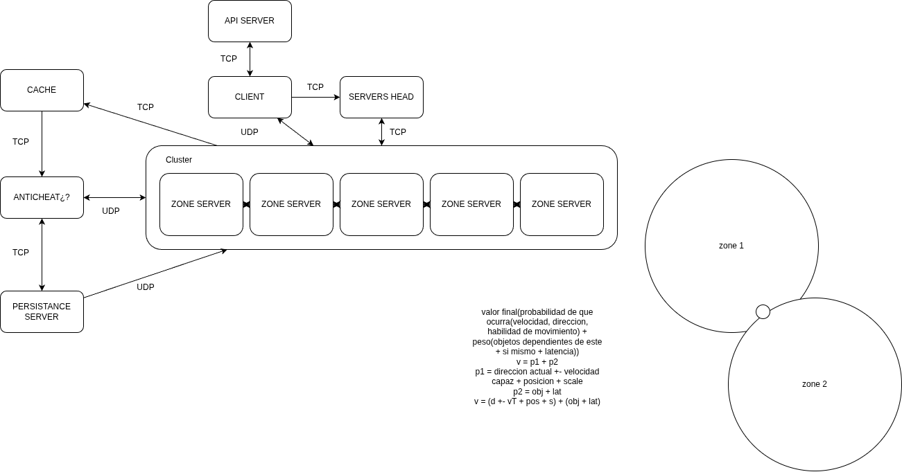

# DGS — Distributed Game Server

A high-performance distributed game server infrastructure written in C++17, designed for massively multiplayer online games with galactic-scale worlds. Built around a microservice architecture with Linux epoll I/O, TCP/UDP networking, Kubernetes orchestration, and real-time anti-cheat validation.

---

## Architecture

[](Network%20Haruka.drawio)

---

## Features

- **epoll-based I/O** — non-blocking event loop across all nodes
- **TCP framing** — 4-byte length prefix to handle partial reads
- **Delta compression** — `EntityTransfer.dataSize` serializes only used bytes from `data[4096]`
- **Chunk coordinate system** — galactic scale with `int32_t` chunks (km) + `float` local position (mm precision)
- **Anti-cheat validation** — position verified with `radio = v·Δt + scale + latency_compensation` in 3D
- **ThreadPool** — N-worker producer/consumer with `std::mutex` + `std::condition_variable`
- **Async CSV logger** — lock-free logging via ThreadPool(1 worker)
- **Kubernetes auto-scaling** — Orchestrator calls k8s REST API to scale ZoneNode deployments
- **Dynamic chunk sizes** — chunk dimensions sent from HeadServer at node startup (`chunkSizeX/Y/Z` in km)

---

## Node Overview

| Node | Protocol | Port | Role |
|------|----------|------|------|
| `head_server_node` | TCP | 42424 | Orchestration, zone routing, k8s scaling |
| `zone_node` | TCP + UDP | 42420 | Entity simulation, metrics reporting |
| `cache_node` | TCP | 42425 / 42426 | Transfer queue between zones and anticheat |
| `anticheat_node` | UDP + TCP | 42427 / 42428 | Position validation, forward to persistence |
| `persistance_node` | TCP | 42429 | MongoDB write, async CSV log |
| `client_node` | HTTP + TCP + UDP | — | Login API → zone discovery → game |

---

## Tech Stack

- **Language** — C++17
- **Build** — CMake 3.14+ with FetchContent
- **Networking** — Raw POSIX sockets, Linux epoll
- **Database** — MongoDB via mongocxx 4.x
- **HTTP** — [cpp-httplib](https://github.com/yhirose/cpp-httplib) (header-only)
- **Containers** — Docker multi-stage builds
- **Orchestration** — Kubernetes (tested with minikube)

---

## Project Structure

```
dgs/
├── include/dgs/
│   ├── types.h          # All shared structs and enums
│   ├── packet.h/cpp     # Serialization (pack/unpack)
│   ├── network.h/cpp    # TCPSocket, UDPSocket
│   ├── orchestrator.h   # Zone topology + k8s API scaling
│   ├── thread_pool.h    # N-worker ThreadPool
│   └── logger.h         # Async CSV logger
├── nodes/
│   ├── head_server_node.cpp
│   ├── zone_node.cpp
│   ├── cache_node.cpp
│   ├── anticheat_node.cpp
│   ├── persistance_node.cpp
│   └── client_node.cpp
├── src/
│   ├── packet.cpp
│   └── network.cpp
├── docker/              # Dockerfile per node
├── k8s/                 # Kubernetes manifests
│   ├── namespace.yaml
│   ├── mongodb/
│   ├── head-server/     # Deployment + Service + RBAC
│   ├── zone-node/       # Deployment + Service + HPA
│   ├── cache/
│   ├── anticheat/
│   ├── persistence/
│   └── deploy.sh
├── tests/
│   ├── ping_pong.cpp
│   ├── thread_pool_test.cpp
│   └── logger_test.cpp
└── third_party/

```

---

## Building

**Dependencies:**
- CMake ≥ 3.14
- GCC/Clang with C++17
- OpenSSL (`libssl-dev`)
- mongocxx driver ≥ 4.x

```bash
cmake -S . -B build -DCMAKE_BUILD_TYPE=Release
cmake --build build -j$(nproc)
```

Binaries are placed in `build/`.

---

## Running Locally

Each node reads its configuration from environment variables. Defaults point to Kubernetes service DNS names.

```bash
# HeadServer
./build/head_server_node

# ZoneNode (chunk range in chunk units)
CHUNK_X_MIN=0 CHUNK_X_MAX=100 \
CHUNK_Y_MIN=0 CHUNK_Y_MAX=100 \
CHUNK_Z_MIN=0 CHUNK_Z_MAX=100 \
HEAD_SERVER_HOST=127.0.0.1 \
./build/zone_node

# AntiCheat
HEAD_SERVER_HOST=127.0.0.1 PERSISTENCE_HOST=127.0.0.1 \
./build/anticheat_node

# Persistence
MONGO_URI=mongodb://localhost:27017 ./build/persistance_node
```

---

## Deploying to Kubernetes (minikube)

```bash
# Start minikube
minikube start --driver=docker

# Build images and apply all manifests
./k8s/deploy.sh

# Monitor
kubectl get pods -n dgs -w
```

The HeadServer uses a `ServiceAccount` with a `Role` scoped to patching the `zone-node` Deployment, so it can scale ZoneNodes via the Kubernetes REST API when load thresholds are exceeded (`RAM > 80%`).

---

## Coordinate System

World space uses a two-level system to achieve galactic scale with millimeter precision:

```
Global position = chunkIndex * chunkSize + localPos

chunkIndex  → int32_t   (chunk grid coordinates)
chunkSize   → float km  (sent by HeadServer at startup, e.g. 1.5 km)
localPos    → float km  (sub-chunk precision: ~0.000001 km = 1 mm)
```

Zone boundaries are defined per-node as `[chunkXMin, chunkXMax] × [chunkYMin, chunkYMax] × [chunkZMin, chunkZMax]`.

---

## Anti-Cheat

Position updates arrive via UDP from ZoneNodes and via TCP from the CacheNode. Each is validated against the last known position:

```
radio = (maxSpeed × Δt) + SCALE + (LATENCY_COM × maxSpeed)
```

If the reported position lies outside `radio`, the packet is dropped and the event is logged.

---

## Environment Variables

| Variable | Default | Used by |
|----------|---------|---------|
| `HEAD_SERVER_HOST` | `head-server` | zone_node, anticheat |
| `HEAD_SERVER_PORT` | `42424` | zone_node, anticheat |
| `PERSISTENCE_HOST` | `persistence` | anticheat |
| `PERSISTENCE_PORT` | `42429` | anticheat |
| `ANTICHEAT_UDP_PORT` | `42427` | anticheat |
| `ANTICHEAT_TCP_PORT` | `42428` | anticheat |
| `MONGO_URI` | `mongodb://mongodb:27017` | persistence |
| `API_HOST` | `api` | client |
| `API_PORT` | `8080` | client |
| `HTTPS_ENABLE` | _(unset)_ | client |
| `CHUNK_X/Y/Z_MIN/MAX` | `0 / 100` | zone_node |

---

## License

MIT
